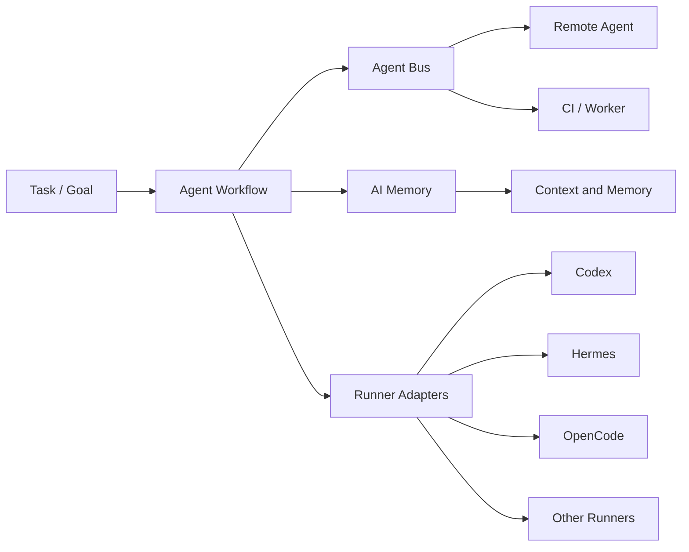

# Agent Workflow

**A model-agnostic workflow contract and orchestration core for AI agents.**

Agent Workflow defines *who does what, in what order, handing off what artifacts, under whose authority*. It does not run models or send messages — it provides the control plane that coordinates those systems.

## Why This Exists

Multi-agent systems today suffer from three problems:

1. **No standard handoff**: Agents pass free-form chat messages with no structure, audit trail, or machine-readable state.
2. **Tight coupling**: Workflow logic is baked into specific agent implementations (Codex, Hermes, OpenCode, etc.), making it impossible to swap runners.
3. **No boundaries**: Control logic, event transport, and memory management are tangled — change one and you break the others.

Agent Workflow solves this by separating concerns into three independent projects.

## Architecture



### The Three-Project Stack

| Project | Plane | Responsibility |
|---------|-------|---------------|
| **Agent Workflow** | Control Plane | Roles, stages, state, policy, artifact-based handoff |
| **Agent Bus** | Event / Transport Plane | Cross-machine event relay, durable delivery, remote notification |
| **AI Memory** | Context / Memory Plane | Long-term context, memory lifecycle, shared knowledge |

### Boundaries

1. Agent Workflow **does not** implement a cross-machine messaging system. That is Agent Bus.
2. Agent Workflow **does not** implement long-term memory. That is AI Memory.
3. Agent Workflow **does not** bind to Codex, Hermes, OpenCode, Claude Code, or any single model.
4. Agent Bus and AI Memory are **optional adapters** — upgrades, not requirements.
5. The core must run with only local files and a local shell runner.
6. **No circular dependencies** between the three projects.
7. Agents hand off via **structured Artifacts**, not free-form chat logs.

## Core Concepts

### Role
A role defines *responsibilities*, *capabilities*, and *constraints*. It does not bind to a model, tool, or runner. Example roles: `planner`, `implementer`, `tester`, `reviewer`, `summarizer`, `arbiter`.

### Workflow
A workflow defines *stages* and their *transitions*. Each stage is assigned a role. Example: `plan → implement → test → review → summarize → decide`.

### Stage
A stage is a single unit of work within a workflow. Stages have defined inputs, outputs, policies, success/failure transitions, and optional memory hints.

### Binding
A Binding Profile maps roles to concrete runners. A `planner` can be bound to `shell` locally or `codex` remotely — the workflow definition does not change.

### Artifact
Structured handoff documents between stages. Types include `TaskCard`, `ImplementationReport`, `TestReport`, `ReviewReport`, `DecisionPacket`, `Decision`, and `MemoryWriteCandidate`. Artifacts carry machine-readable data and human-readable summaries.

### Policy
Per-stage rules that constrain behavior. Policies can allow, deny, or warn on specific actions.

### Runner
A Runner executes a stage. Runners can be local shell commands, remote agents (Codex, Hermes, OpenCode), or mock implementations for testing.

## Quick Start

```bash
# Install
pip install -e .

# Validate all resources
awf validate roles workflows profiles examples

# Inspect a resource
awf inspect workflows/feature-delivery.yaml

# Check version
awf version
```

## CLI Examples

```bash
# Validate a single file
awf validate roles/planner.yaml
# PASS roles/planner.yaml

# Validate a directory
awf validate roles
# PASS roles/planner.yaml
# PASS roles/implementer.yaml
# ...

# Recursive validation
awf validate .
# PASS roles/planner.yaml
# FAIL examples/broken/workflow.yaml: spec.stages[0].role is required
# ...
# 42/44 passed, 2 failed

# Inspect a workflow
awf inspect workflows/feature-delivery.yaml
# apiVersion: agent-workflow/v1alpha1
# kind: Workflow
# name: feature-delivery
# version: 0.1.0
# stages: 6
#   - plan [planner] (onSuccess: implement, onFailure: failed)
#   - implement [implementer] (onSuccess: test, onFailure: failed)
#   ...

# Inspect a role
awf inspect roles/planner.yaml
# capabilities (4):
#   - Read task descriptions and requirements
#   - Read project structure and documentation
#   ...
# forbiddenActions (4):
#   - Modify code or configuration files
#   ...
```

## Example Workflow: Feature Delivery

```yaml
apiVersion: agent-workflow/v1alpha1
kind: Workflow
metadata:
  name: feature-delivery
spec:
  stages:
    - id: plan          # planner → TaskCard
    - id: implement     # implementer → ImplementationReport
    - id: test          # tester → TestReport, onFailure → implement
    - id: review        # reviewer → ReviewReport, onFailure → implement
    - id: summarize     # summarizer → DecisionPacket
    - id: decide        # arbiter → Decision (approve | request_changes | reject | escalate)
```

## Repository Structure

```
agent-workflow/
├── docs/               # Architecture, concepts, ADRs, integration guides
├── schemas/            # JSON Schema definitions for all resource kinds
├── roles/              # Default role definitions
├── workflows/          # Default workflow definitions
├── profiles/           # Example binding profiles
├── templates/          # Artifact templates
├── examples/           # Complete example configurations
├── src/agent_workflow/ # Python package
│   ├── cli.py          # CLI entry point (awf)
│   ├── validation.py   # Schema + semantic validation
│   ├── models.py       # Data models
│   ├── errors.py       # Error types
│   ├── ports/          # Abstract interfaces (Protocols)
│   └── adapters/       # Local implementations
└── tests/              # Test suite
```

## Current Status

**Phase 0 — Contract Bootstrap** (current)

- ✅ Repository and project structure
- ✅ JSON Schema definitions for all resource kinds
- ✅ Default role definitions (planner, implementer, tester, reviewer, summarizer, arbiter)
- ✅ Default workflow definitions (feature-delivery, bugfix, documentation, research)
- ✅ Artifact templates for all handoff types
- ✅ Validation CLI (`awf validate`, `awf inspect`)
- ✅ Schema validation tests
- ✅ Semantic validation tests
- ✅ CI pipeline (GitHub Actions)
- ✅ Agent Bus integration contract
- ✅ AI Memory integration contract
- ✅ Local adapter stubs

Agent Workflow is planned to integrate with Agent Host as the `workflow.engine` plugin. It remains independently runnable today; plugin integration has not been implemented yet.

## What Agent Workflow Is Not

Agent Workflow is **not**:

- an LLM
- a coding agent
- a replacement for Agent Bus
- a replacement for AI Memory
- a hosted multi-agent platform
- a visual workflow builder

## Roadmap

See [ROADMAP.md](ROADMAP.md) for the full roadmap.

| Phase | Scope | Status |
|-------|-------|--------|
| 0 | Contract Bootstrap | ✅ Current |
| 1 | Local Workflow Runtime | 📋 Planned |
| 2 | Agent Bus Adapter | 📋 Planned |
| 3 | AI Memory Adapter | 📋 Planned |
| 4 | Runner Adapters | 📋 Planned |

## License

MIT — see [LICENSE](LICENSE).
